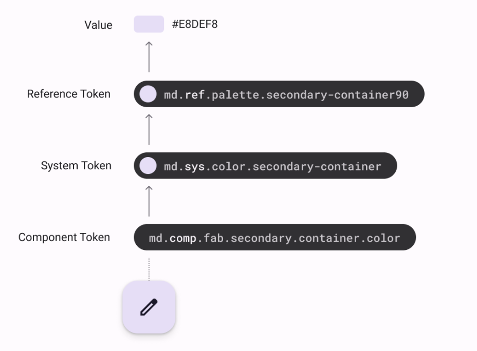
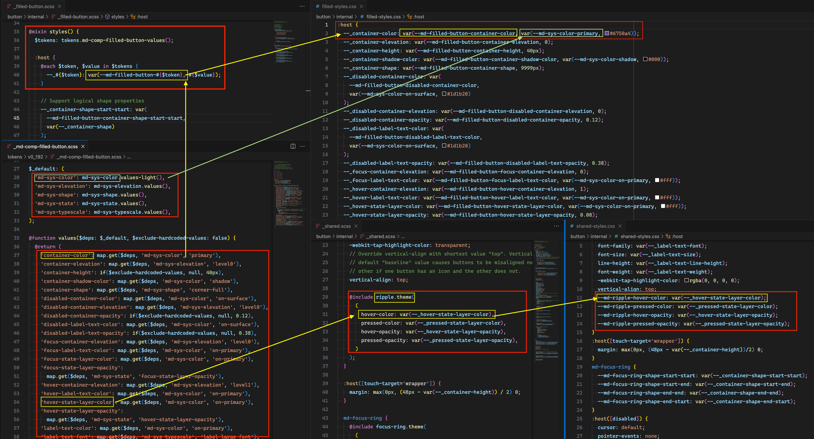
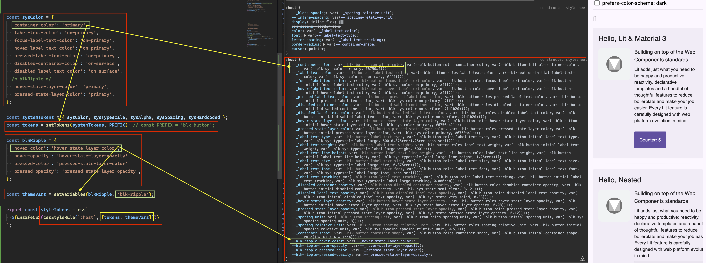
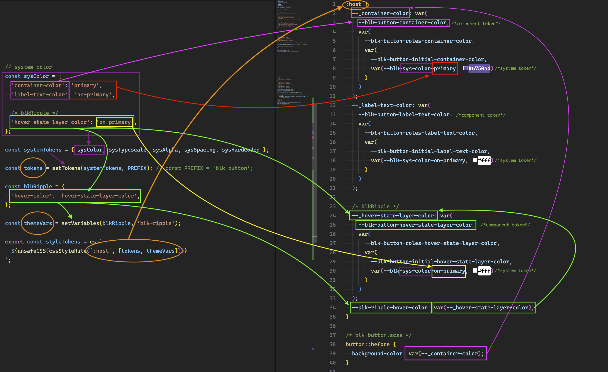
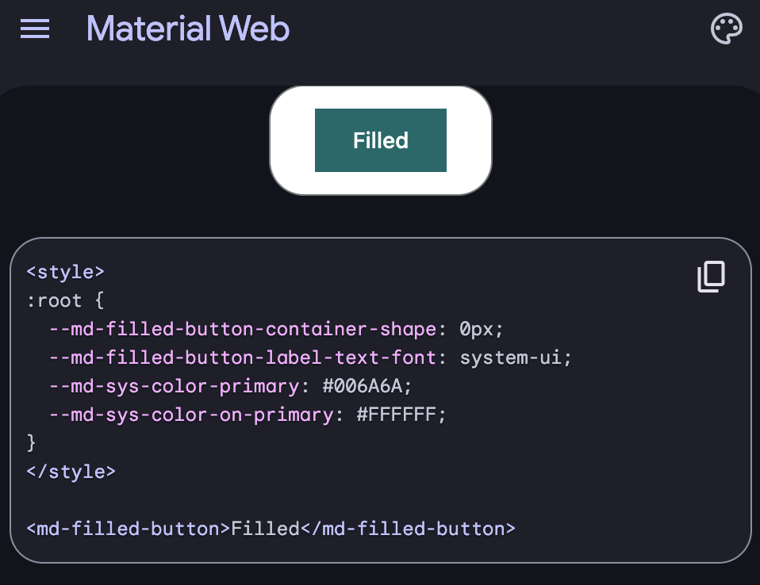
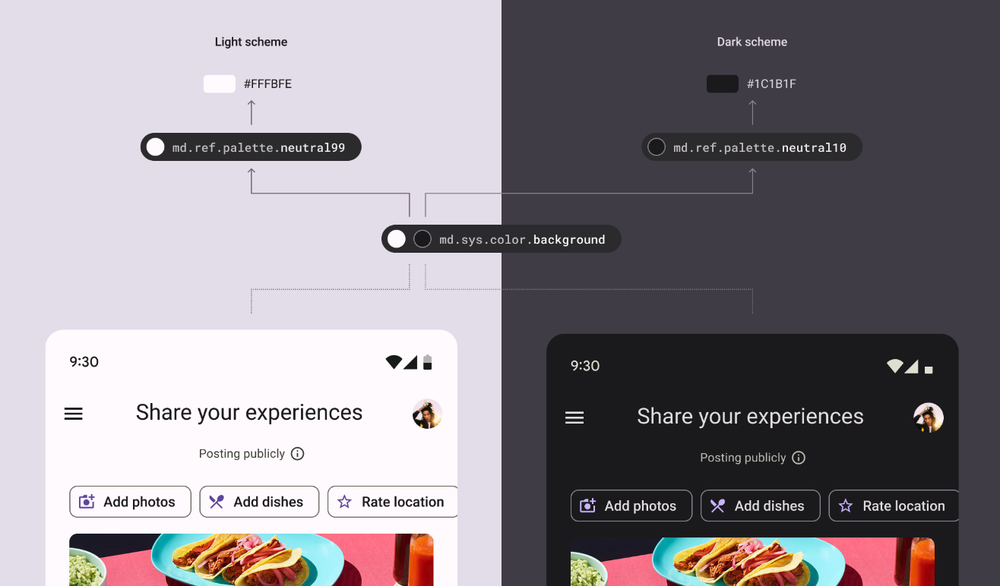
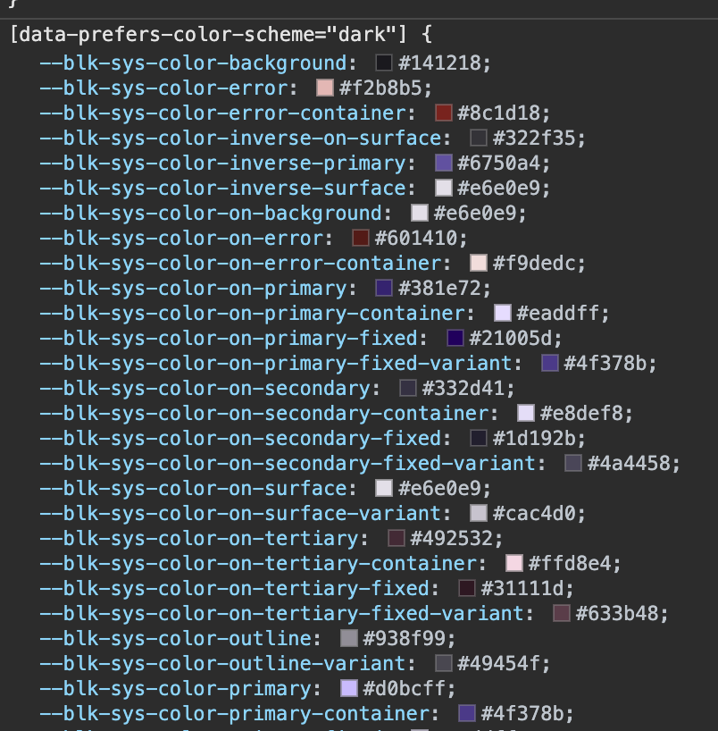
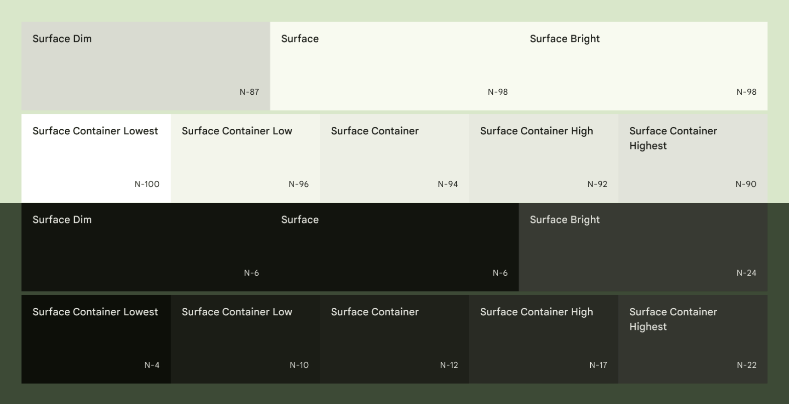

# JavaScript-Powered Design Token Generation for Material Design

- [Introduction](#introduction)
- [Types of tokens and how to generate them](#types-of-tokens-and-how-to-generate-them)
  - [Setting tokens like CSS custom properties](#setting-tokens-like-css-custom-properties)
- [One step further - Context and Roles](#one-step-further---context-and-roles)
  - [Context](#context)
  - [Roles](#roles)
    - [Setting Roles like CSS custom properties](#setting-roles-like-css-custom-properties)
- [Interaction states](#interaction-states)
  - [state](#state)
  - [onto-state](#onto-state)
- [Naming](#naming)

<hr>

## Introduction

This exercise serves as a proof of concept, aiming to emulate as faithfully as possible the design token generation process utilized by the Material Design team, which relies on the Sass preprocessor.
It employs a purely JavaScript-based approach and consumes the tokens in the browser in real-time.
## Types of tokens and how to generate them

> [There are three kinds of tokens in Material](https://m3.material.io/foundations/design-tokens/how-to-read-tokens#efa90c6e-92da-4af3-8031-f0520540df25)

1. Reference token
2. System token
3. Component token



Diagram of a button that receives its container color through a system of three tokens that define scalable color values. The color tokens point to a specific hex value that can easily change without impacting the token syntax.

<hr>

### `<md-filled-button>` component

- Reference tokens: [md-ref-palette.scss](https://github.com/material-components/material-web/blob/main/tokens/_md-ref-palette.scss)
- System tokens: [md-sys-color.scss](https://github.com/material-components/material-web/blob/main/tokens/_md-sys-color.scss)
- Component tokens:
  - [md-comp-filled-button.scss](https://github.com/material-components/material-web/blob/main/tokens/_md-comp-filled-button.scss)
    - [internal/filled-button.scss](https://github.com/material-components/material-web/blob/main/tokens/v0_192/_md-comp-filled-button.scss)

**SASS Version**

- [@mixin styles()](https://github.com/material-components/material-web/blob/main/button/internal/_filled-button.scss#L36), using [@function values()](https://github.com/material-components/material-web/blob/main/tokens/v0_192/_md-comp-filled-button.scss#L35), generates in the `:host` selector the necessary CSS private variables, using the "System Tokens" values.
- [@include [name-component.]theme()](https://github.com/material-components/material-web/blob/main/button/internal/_shared.scss#L29) assigns values to the "Component Tokens" of another component using the previously created values.

_@function values() points to v0_192, this version may change, and the link could break._



### `<blk-button>` component

- Reference tokens: [blk-ref-palette.js](https://github.com/oscarmarina/blk-material/blob/main/src/tokens/blk-ref-palette.js)
- System tokens: [blk-sys-color.js](https://github.com/oscarmarina/blk-material/blob/main/src/tokens/blk-sys-color.js)
- Component tokens: [blk-button-tokens.js](https://github.com/oscarmarina/blk-material/blob/main/src/styles/blk-button-tokens.js)

**JS Version**

- [setTokens()](https://github.com/oscarmarina/blk-material/blob/main/src/styles/blk-button-tokens.js#L53) generates in the `:host` selector the necessary CSS private variables, using the "System Tokens" object.
- [setVariables()](https://github.com/oscarmarina/blk-material/blob/main/src/styles/blk-button-tokens.js#L62) assigns values to the "Component Tokens" of another component using the previously created values.
- [styleTokens()](https://github.com/oscarmarina/blk-material/blob/main/src/styles/blk-button-tokens.js#L98) joins the generated CSS variable with a CSS selector, such as `:host`.




Both aim to "generate" a CSS variable for the Component Token and another for the system token with a fallback to the reference value, and provide the possibility to modify both the component token and the System Token.

**Material**

- [Example Theming - filled-button-tokens](https://material-web.dev/components/button/#filled-button-tokens)

```scss
:host {
  --_container-color: var(--md-filled-button-container-color, var(--md-sys-color-primary, #6750a4));
}
```



### Setting Tokens like CSS custom properties

**The entire process of generating tokens is always divided into two parts:**

1. Creating the necessary CSS variables
2. Creating the necessary CSS selectors to apply those variables

```js
import { PREFIX as blkRipplePrefix } from './blk-ripple-tokens.js';

// The { Object } name "identifies" a set of system tokens. - a.k.a sysColor
// The Key "identifies" the private CSS variable and the name for the Component Token.
// The Value "identifies" a specific token in the system token set.
const sysColor = {
  'container-color': 'primary',
  /* blkRipple */
  'hover-state-layer-color': 'on-primary',
};

// 1. setTokens - Creating the necessary CSS variables
const systemTokens = { sysColor, sysTypescale, };
const tokens = setTokens(systemTokens, PREFIX); // const PREFIX = 'blk-button';

// The Key "identifies" the Component Token of another component.
// The Value "identifies" the private CSS variable and the name for the component token.
const blkRipple = {
  'hover-color': 'hover-state-layer-color',
};
// 1. setVariables - Assigns values to Component Token of another component. - blk-ripple-tokens.js
const themeVars = setVariables(blkRipple, blkRipplePrefix); // PREFIX as blkRipplePrefix = 'blk-ripple';
```

```js
// 2. styleTokens - Creating the necessary CSS selectors to apply those variables
export const styleTokens = css`
  ${cssStyleRule(`:host`, [tokens, themeVars])}
`;
```

1. `setTokens` returns

```js
--_container-color: var(--blk-button-container-color, var(--blk-sys-color-primary, #6750a4));
--_hover-state-layer-color: var(--blk-button-hover-state-layer-color, var(--blk-sys-color-on-primary, #fff));

--blk-ripple-hover-color: var(--_hover-state-layer-color);
```

2. `styleTokens` returns

```scss
:host {
  --_container-color: var(
    --blk-button-container-color, /* component token */
    var(--blk-sys-color-primary, #6750a4) /* system token */
  );

  --_hover-state-layer-color: var(
    --blk-button-hover-state-layer-color, /* component token */
    var(--blk-sys-color-on-primary, #fff) /* system token */
  );
  --blk-ripple-hover-color: var(--_hover-state-layer-color); /* component token of another component */
}
```

**blk-button.scss**
```scss
  button:{
    &::before {
    background-color: var(--_container-color);
    border-radius: inherit;
    ...
  }
}
```

**BlkButton.js**

```js
import { LitElement, html, unsafeCSS } from 'lit';
import { styleTokens } from './styles/blk-button-tokens.js';
import { styles } from './styles/blk-button-styles.css.js';
...

export class BlkButton extends LitElement {
  static styles = [unsafeCSS(styleTokens), styles];
  ...
}
```

## One step further - Context and Roles

### Context

- [Example Contexts: Different default values](https://m3.material.io/foundations/design-tokens/how-to-read-tokens#8d5d8fa8-2e9e-4932-8f89-cd29e1c1c3e3)

Tokens can point to different values depending on a set of conditions. These conditions are called “Contexts” and the override values are called contextual values.



The same system token for background color can point to different reference tokens depending on light or dark theme contexts

But “Contexts” is intended to be used with “system tokens” and @media CSS. Media queries allow you to apply CSS styles based on a device's general type, such as print versus screen, or other characteristics

- [Example Dark Mode - dark-color-scheme](https://github.com/oscarmarina/blk-material/blob/main/src/tokens/dark-color-scheme.js#L19)



#### Roles

##### Contained Areas

In addition to color changes based on `Context`, a component might want to alter its display based on its `Contained Areas`.

Surface colors define contained areas, distinguishing them from a background and other on-screen elements.

There are **three core surface roles**:

- surface dim
- surface
- surface bright

In addition to **five surface container roles**:

- surface container lowest
- surface container low
- surface container
- surface container high
- surface container highest



> [More info color-roles in Material](https://m3.material.io/styles/color/roles)

##### Setting Roles like CSS custom properties

As mentioned in [Setting Tokens like CSS custom properties](#setting-tokens-like-css-custom-properties) the foundation involves creating a CSS variable that "reflects" the **_component token_** and another that "reflects" the **_system token_**.​

[setTokens()](#blk-button-component) **also** creates a variable intended to "receive roles values".

> The component that "exposes" these values is responsible for providing them with the necessary value.

```scss
--_container-color: var(
  --blk-button-container-color,
  var(
    --blk-button-roles-container-color, /* roles values */
    var(--blk-button-initial-container-color, var(--blk-sys-color-primary, #6750a4))
  )
);
```

#### Setting the necessary value to the "roles values”

Similar to the other tokens, the process is always divided into two parts:

1. creating the necessary CSS variables
2. generating the required CSS selectors to apply those variables.

```js
// The { Object } name "identifies" a contained areas roles
// The Key "identifies" the "roles value" CSS variable.
// The Value "identifies" a specific token in the system token set.
const dim = {
  'container-color': 'secondary',
};
const surface = {
  'container-color': 'primary',
};
const bright = {
  'container-color': 'tertiary',
};

// 1. setRoles - Creating the necessary CSS variables
const systemRoles = { dim, surface, bright };
const roles = setRoles(systemRoles, PREFIX); // const PREFIX = 'blk-button';
```

```js
// 2. styleRoles - Creating the necessary CSS selectors to apply those variables (roles ralues)
export const styleRoles = Object.entries(roles)
  .map(([role, value]) => cssStyleRule(`:host([${ROLES}="${role}"])`, [value]))
  .join('');


// Join all tokens styles
export const styleTokens = `
  ${cssStyleRule(`:host`, [tokens, themeVars])}
  ${styleRoles}
`;
```

2. styleTokens returns

```scss
...

:host([roles='dim']) {
  --blk-button-roles-container-color: var(
    --blk-button-roles-dim-container-color, /* new component token for roles values */
    var(--blk-sys-color-secondary, #625b71)
  );
}

:host([roles='surface']) {
  --blk-button-roles-container-color: var(
    --blk-button-roles-surface-container-color, /* new component token for roles values */
    var(--blk-sys-color-primary, #6750a4)
  );
}

:host([roles='bright']) {
  --blk-button-roles-container-color: var(
    --blk-button-roles-bright-container-color, /* new component token for roles values */
    var(--blk-sys-color-tertiary, #7d5260)
  );
}
```

> The function `setRoles()` also generates a "Component Token" associated with "role value" to be able to modify if necessary.

```scss
  --blk-button-roles-container-color: var(
    --blk-button-roles-bright-container-color, /* new component token for roles values */
    var(--blk-sys-color-tertiary, #7d5260)
  );
```

#### Initial CSS variable

When generating [tokens](#blk-button-component), a **mild** CSS Variable is created, and it will always have the lowest specificity compared to the rest of the "component tokens / roles values"
It can be used with the awareness that when a selector for role values is used, it will be overwritten.
Alternatively, if role values are not used and there's a need to override a value while still keeping the component token variable available, the initial CSS variable can be used.

```scss
--_container-color: var(
  --blk-button-container-color,
  var(
    --blk-button-roles-container-color,
    var(
      --blk-button-initial-container-color, /* initial `mild` value */
      var(--blk-sys-color-primary, #6750a4)
    )
  )
);
```

<hr>

## Interaction states

> https://m3.material.io/foundations/interaction/states/applying-states

An `activated` state differs from a `selected` state because it communicates a highlighted destination.

> - https://m2.material.io/design/interaction/states.html#selected
> - https://github.com/material-components/material-web/blob/main/tokens/_md-comp-filter-chip.scss

### States

States can be combined with onto-states, such as:

- `enabled/default` and `hover`
- `selected` and `focused`
- `activated` and `pressed`

#### state

- Enabled
  - Disabled
- Selected
  - Unselected
- Activated

#### onto-state

- Hover
- Focused
- Pressed
- Dragged

### Naming:

[component-token]-[variant?]-[state?]-[onto-state?]-[element?]-[css-property]

- --md-primary-tab-[variant?]-[activated]-label-text-color
- --md-primary-tab-[variant?]-[activated]-[hover]-label-text-color
- --md-primary-tab-[variant?]-[activated]-[focused]-label-text-color
- --md-primary-tab-[variant?]-[activated]-[pressed]-label-text-color

<br>

- --md-primary-tab-['positve']-[activated]-label-text-color
- --md-primary-tab-['positve']-[activated]-[hover]-label-text-color
- --md-primary-tab-['positve']-[activated]-[focused]-label-text-color
- --md-primary-tab-['positve']-[activated]-[pressed]-label-text-color

<hr>

- ~~[Fix not showing inner swatches for var() function](https://bugs.chromium.org/p/chromium/issues/detail?id=1499265)~~

